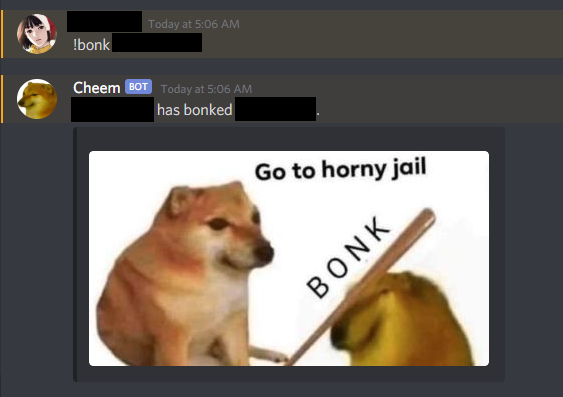

# Bonk
Users will enter the following syntax:

```
Test:
!bonk @user
```

And the bot should send back with the following:

```
@Test + " has bonked " + @user +"."
```


# EDIT @ 5:07 AM:
It is a success!


